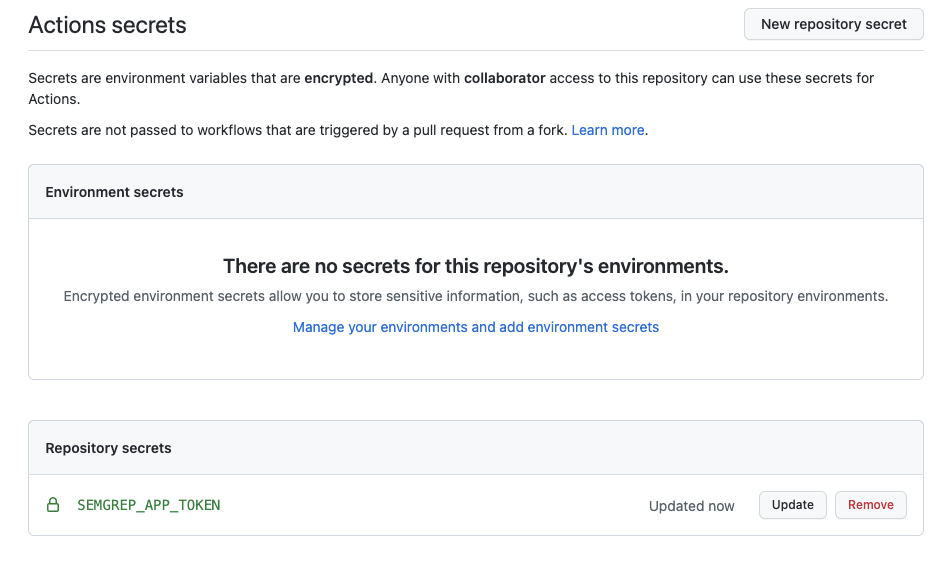

# Texas Cyber Summit Semgrep.dev Exercise

### 1. Fork https://github.com/nVisium/django.nV

### 2. Install the semgrep-dev GitHub App

On **semgrep.dev**:

1. Click on **Projects**
2. Click on **Setup New Project**
3. Click on **GitHub Actions**
4. Click on **Get started**
5. Review the permissions, and click on **Continue**
6. Click on the organization you wish to use
7. Select **Only select repositories** and select **django.nV**

8. Click **Install & Authorize**

### 3. Install Semgrep on the project

On **semgrep.dev**:

1. Click on **Projects**
2. In the table, click on **Add CI job** for the project
3. Click **Commit file**
4. Copy the **Secret Value**

5. Click on **your repository’s secrets →**
6. In the top left, click **New repository secret**
7. Fill in the **Name** as **SEMGREP_APP_TOKEN**
8. Fill in the **Value** with the **Secret** **Value** you copied in step (4)
9. Click **Add secret**

10. Click **The secret’s there, continue**
11. Wait fo the first scan to complete

### 4. Configure rules

1. Remove all the rule cards
2. Add the **xss**, **django**, **sql-injection**, and **python** rule cards
    1. [Optional] To reduce noise, click on **Projects**, click on your project, and add **static/** to the **Path Ignores** textbox
3. Navigate to your project on GitHub
4. Click on the **Actions** tab
5. Click on the **Semgrep** action
6. Click on the dots on the right side of the **Add Semgrep CI** entry. Click **Re-run workflow**
7. Wait for the job to finish - this will scan **django.nV** with the rules configured on the rule board.
8. Navigate back to **semgrep.dev**
9. Click on **Findings** and review the findings
    1. [Optional] Check out the findings for `sql-injection-db-cursor-execute` and `direct-use-of-httpresponse`

### Deliver a PR comment

1. Ensure that PR comments are enabled for the **Audit** column by clicking on the bell icon 🔔 

1. Make a branch on your project
    1. `git checkout -b test-pr`
2. Add and commit a file **bad.py** with the contents `5 == 5`
    1. `echo '"hello" is x' > bad.py && git add bad.py && git commit -m "Test PR comment"`
    2. `git push origin test-pr`
3. Make a PR to your project with this branch
    1. Make sure you make the PR to **your project**!

4. Wait for a PR comment

